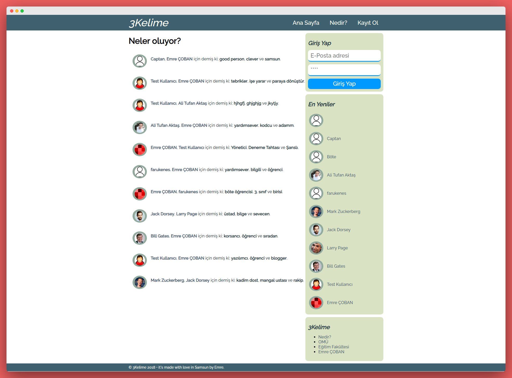
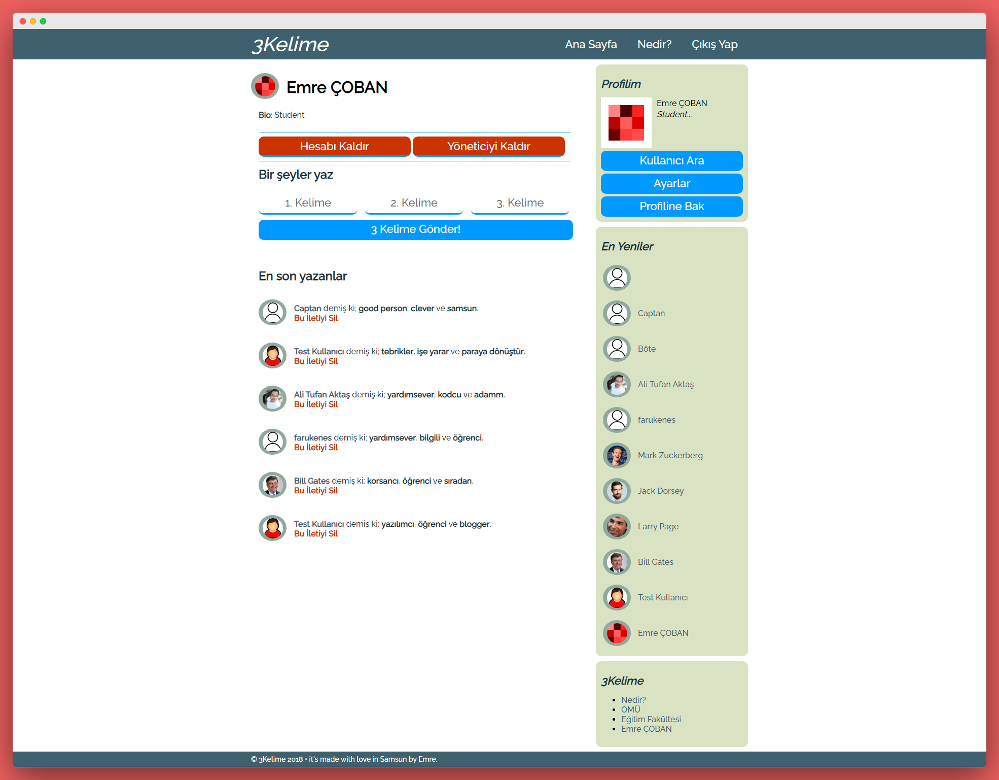
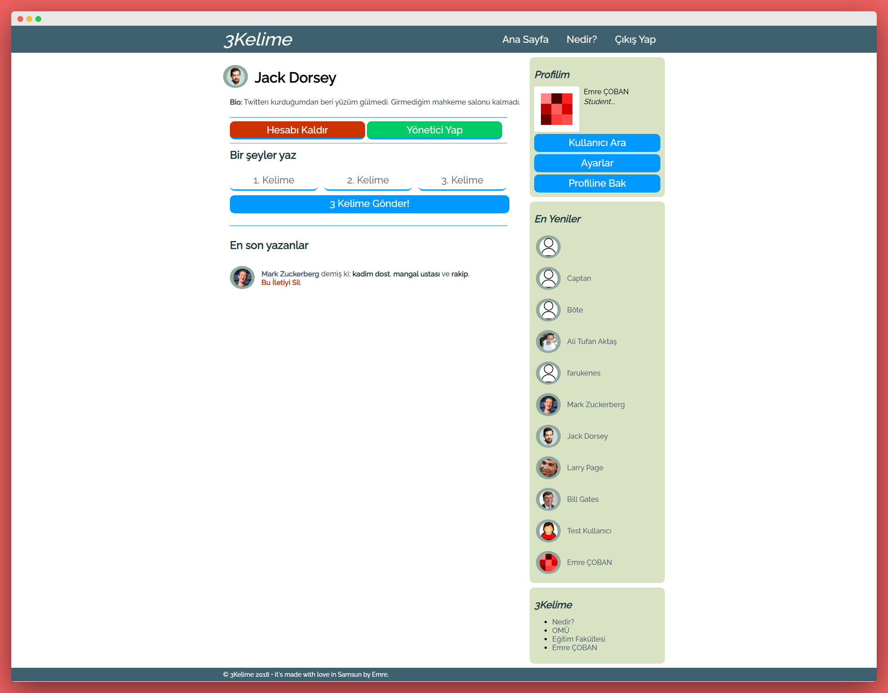
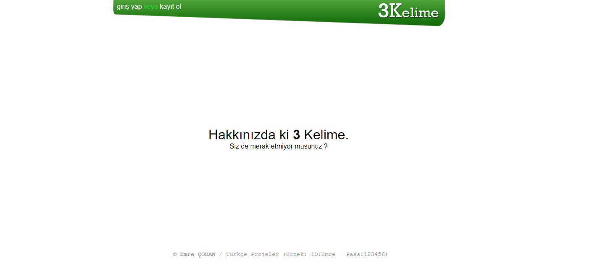
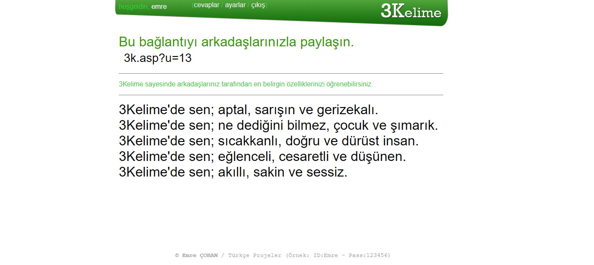
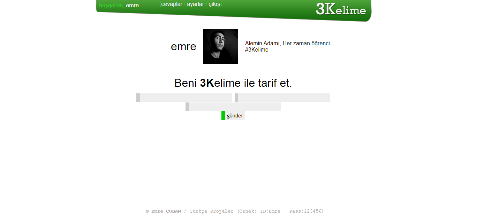

# 3Words
3Words is a social network project, programmed in both Classic ASP and PHP. The first release was published in 2012. The users can write 3 words about themself on their profiles each other in 3Words. The PHP version is better than the ASP version. It is not responsive unfortunately.

## PHP Version

[DEMO](https://3kelime.emrecoban.com.tr)

#### **Membership Types**
- Admin
- User

#### **Database**
- MySQL (the folder of `Database`)

### Screenshots

## ASP Version

#### **Database**
- Microsoft Access

### Screenshots

